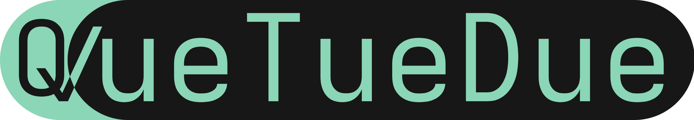

> [!Warning]
>This is the **_experimental_** branch of QueTueDue, usually containing buggy and unfinished features. To get the latest, (mostly) stable release, head to the [main](https://www.github.com/nophoria/QueTueDue/tree/main) branch of QueTueDue.


# QueTueDue


<br>QueTueDue is a simple To-Do app made with PyQt6 that features a toolbar, categories and a system tray icon for quick access to your next To-Do items.

The program has 3 categories: To-Do, In Progress and Done:
<br>

QTD features a toolbar with multiple features - Add, Remove, Remove Done, Remove All:
<br>

QueTueDue's primary feature is the quick-access list inside your system tray, containing your current To-Do items (shown on Arch Linux with hyprland):
<br>

# Roadmap

## To-Add:
 - [x] Mark all as done toolbar action
 - [ ] Colour-coded categories
 - [ ] Keyboard Shortcuts
 - [ ] Statisticts(?)
 - [ ] QML Stylesheets implementation
 - [ ] Installer
 - [ ] Due dates

# Installation
1. Download files as zip
 

2. Extract files


3. Make sure you have Python 3.10+ and PyQt6 installed via pip.
   <br>Install Python from https://python.org (3.10+, written in 3.13).
   <br>Run ```pip install PyQt6``` to install PyQt6 for the progam GUI.

4. Run QueTueDue.pyw (Dosen't run? Try renaming to quetuedue.**py**)

Or:


# Dependencies
QueTueDue depends on the following modules\libraries:

 - Python 3.10+
 - PyQt6 (6.10)
 - Requests

# 
Thanks for checking out this begginner project of mine!
I've _tried_ to abide by PEP 8 as much as possible... but if I've missed a spot feel free to report a bug!
